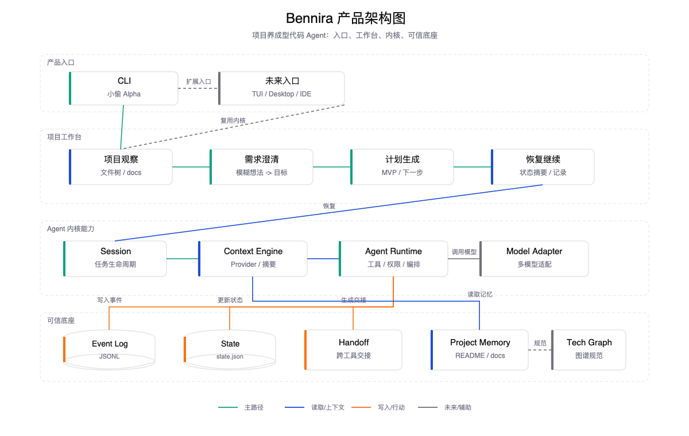
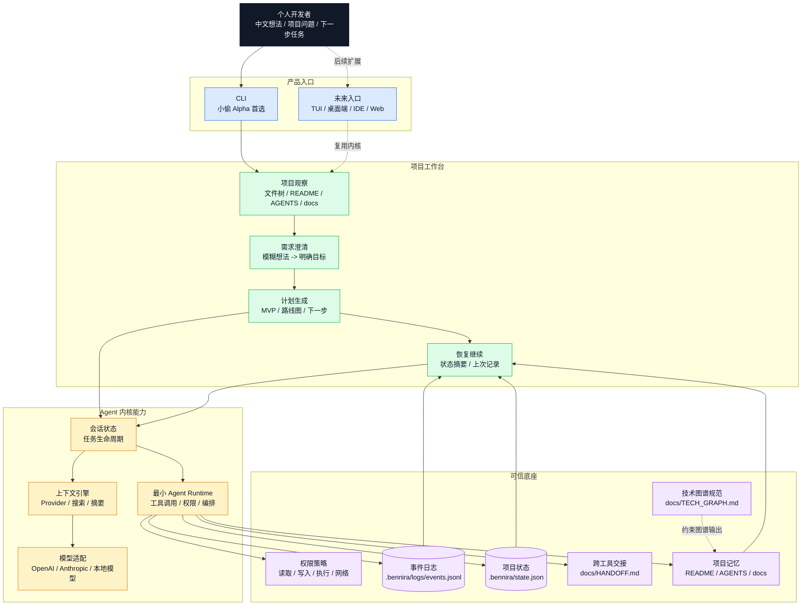
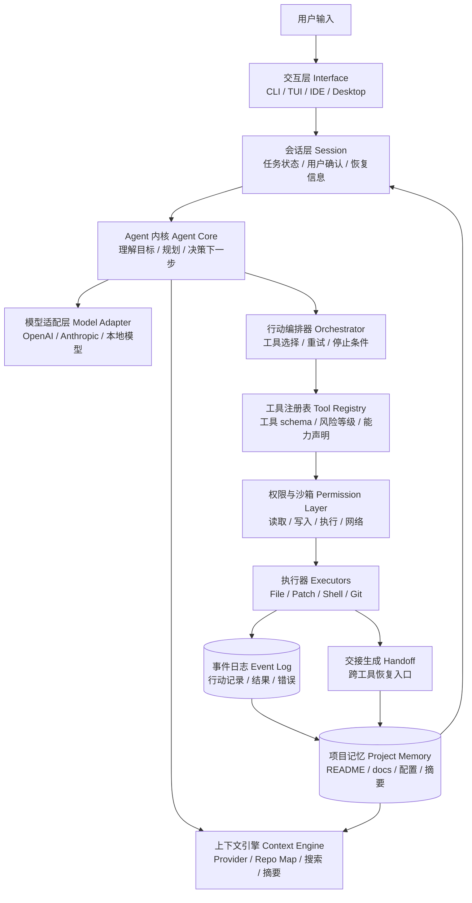
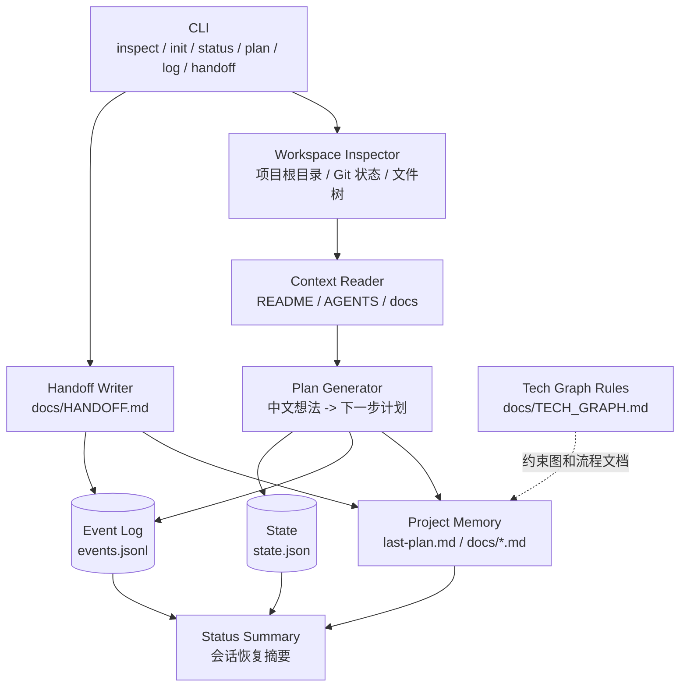
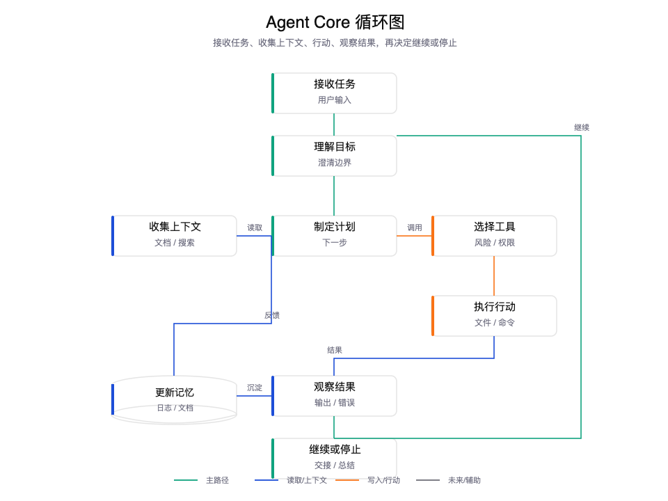

# Bennira 内核架构

> **本文结构**：第一部分「实现现状」描述**当前代码里真实存在**的架构（以此为准）；其后的「设计草案 / 长期架构」是早期规划，保留作为方向参考，可能超前于实现。

---

## 一、实现现状（与代码一致）

### 分包与边界

Bennira 是 npm workspaces monorepo，两个零第三方依赖的包（均 `type: module`，纯 `.mjs`，Node `>=20`）：

| 包 | 角色 | 职责 |
|---|---|---|
| `@bennira/core` | **决策侧 + 纯逻辑** | 模型 provider、agent 协议、配置/凭证/主题/事件、REPL 输入侧纯函数、方向键交互组件。可离线单测。 |
| `@bennira/cli` | **执行侧 + 交互** | 命令路由、setup 向导、REPL、`executeTool`（真正的 fs / exec）。唯一依赖 `@bennira/core`。 |

**关键原则**：决策（模型输出 `{thought, action, args}` JSON）在 core，执行（解析 + fs/exec）在 cli。两侧通过内存中的 `history` 数组传递，形成 agentic 闭环。

### Agentic 闭环（真实循环）

```text
用户输入
  ↓
buildAgentMessages(history)           [core]  组装消息
  ↓
provider.generate(messages,{signal})  [core]  模型决策，吐 JSON
  ↓
parseAgentAction(text)                [core]  容错解析，兜底 finish
  ↓
executeTool(action, args)             [cli]   落地：read_file/list_files/search/write_file/run_command
  ↓
history.push([观察结果])                       回喂
  ↓
（循环，最多 MAX_STEPS=12，直到 action=finish 交付）
```

`generateStream` 走 SSE 逐 token（用于 `/init` `/plan` 与流式回答）；`generate` 非流式（用于 agentic 每一步的结构化 JSON 决策，防漂移）。二者都接受外部 `{signal}`，与内部超时 signal 通过 `linkAbort` 合流；Ctrl+C 触发 `UserAbortError(code=USER_ABORT)`，与「超时/网络失败」精确区分。

### 实际工具集（agent.mjs 的 `AGENT_TOOLS`）

| 工具 | 风险 | 说明 |
|---|---|---|
| `read_file` | safe | 读文件（上限 `MAX_READ_CHARS=6000`） |
| `list_files` | safe | 列目录 |
| `search` | safe | 文本搜索 |
| `write_file` | **danger** | 写文件，执行前确认 |
| `run_command` | **danger** | 跑命令（`execSync`，超时 120s），执行前确认 |
| `finish` | safe | 交付最终答案，结束循环 |

> 注：本节工具集是**当前实现**。下文「工具注册表」小节列的是早期设计命名（`write_doc` / `git_status` 等），已被上表取代。

### 权限默认值（memory.mjs 的 `defaultConfig`）

| 权限 | 默认 | 含义 |
|---|---|---|
| 读取 | 允许 | 读文件 / 列目录 / 搜索 |
| 写入 | **需确认** | 修改工作区文件 |
| 执行 | **禁止**（deny）| 运行本地命令 |
| 网络 | **禁止**（deny）| 访问模型 API |

### REPL 与输入侧能力

- slash 命令：`/help` `/status` `/init` `/plan` `/clear` `/exit`（`repl-support.mjs` 的 `SLASH_COMMANDS` 为单一事实源，帮助与 Tab 补全同源）。
- `@文件` 引用（`input-support.mjs`）：`extractAtMentions` 提取、`atFileCompleter` 补全、提交时把文件内容作独立上下文块注入。
- 多行输入：`feedInputLine` 状态机——反斜杠续行 + 三引号块。
- 历史：`normalizeHistory` / `appendHistory`，落 `~/.bennira/repl_history`（跨会话共享）。

### 落盘

- 全局层 `~/.bennira/`（`globalRoot()`，可被 `BENNIRA_HOME` 覆盖）：`config.json` / `secrets.json` / `repl_history`。
- 项目层 `<project>/.bennira/`：`config.json` / `secrets.json`（chmod 600，自动 gitignore）/ `state.json` / `logs/events.jsonl` / `last-plan.md`。
- 密钥优先级：env → 项目 secrets → 全局 secrets。

### 语言与技术形态（现状修正）

早期草案设想 TypeScript；**实际实现是纯 Node.js ESM（`.mjs`）+ 原生 fetch，零第三方运行时依赖**，测试用 `node:test`。这一取舍换来了「零依赖、免构建、`npm link` 后改码即生效」的轻量迭代。

### 测试

`node --test`，11 个测试文件、110 用例，全部离线不需要真实 key。见 README「开发」一节。

---

## 二、设计草案 / 长期架构（早期规划，供方向参考）

> 以下为 Alpha 初期的设计草案，部分能力（如 Shell 执行）**已在上文「实现现状」中落地**，部分（MCP / 多 Agent / 插件）仍是未来方向。阅读时以第一部分为准。

## 架构目标

Bennira 的内核要先解决可扩展性，而不是先解决界面完整性。

第一阶段可以很小，但边界必须清楚：

- 模型可以替换。
- 工具可以扩展。
- 权限可以收紧或放宽。
- 记忆可以沉淀。
- 插件可以接入。
- UI 表面可以更换。

但第一版不能把这些能力全部实现。架构的任务是预留边界，Alpha 的任务是跑通最短闭环。

## 总体架构

### 产品架构图

这张图面向产品讨论，用来说明 Bennira 到底由哪些产品能力组成。





这张图表达的是：

- 用户看到的是“项目工作台”，不是底层技术模块。
- `小偷 Alpha` 只从 CLI 入口进入。
- CLI、TUI、桌面端、IDE、Web 以后都应该复用同一个 Agent 内核。
- Bennira 的差异化底座是项目记忆、事件日志、权限策略和恢复继续。

### 长期架构图




### 小偷 Alpha 架构图

`小偷 Alpha` 只实现长期架构中的最小子集：




## 核心模块

## Alpha 内核边界

`小偷 Alpha` 只实现下面这些模块：

- Workspace：识别当前项目目录和基础文件树。
- Project Memory：读取和更新仓库内文档。
- Context Reader：按优先级读取 `README.md`、`AGENTS.md`、`docs/`。
- Plan Generator：把中文想法整理成项目计划。
- Event Log：记录读取、计划、写入和总结事件。
- Permission Policy：先定义权限模型，Alpha 只允许文档写入前确认。
- Tool Registry：只注册文件读取、文本搜索、文档写入、状态查看四类工具。

Alpha 暂不实现（**注：其中「真实 Shell 命令执行」现已实现，见第一部分工具集 `run_command`；其余仍为未来方向**）：

- 真实 Shell 命令执行。
- 复杂 Git 操作。
- 自动测试。
- MCP。
- 插件加载。
- 多 Agent。
- 浏览器。

这些能力保留在架构中，但不进入 Alpha 交付范围。

### 交互层 Interface

负责用户如何使用 Bennira。

第一阶段建议只做一种表面：

- CLI：最容易实现，最适合验证内核。
- TUI：比纯 CLI 体验更好，但开发成本略高。

暂缓：

- 完整桌面端。
- Web 应用。
- IDE 插件。
- 多 Agent 看板。

交互层不能直接操作文件或命令，必须通过 Agent Core。

### 会话层 Session

负责一次对话或任务的生命周期。

需要保存：

- 当前工作区路径。
- 用户原始输入。
- 当前任务状态。
- 已读上下文摘要。
- 已调用工具。
- 用户确认记录。
- 最终结果。

会话层的关键原则：

- 所有重要状态都可导出。
- 不依赖单次聊天上下文。
- 中断后能恢复。

### Agent 内核 Agent Core

负责决定“下一步做什么”。

核心循环：



```text
接收任务
  ↓
理解目标
  ↓
收集上下文
  ↓
制定计划
  ↓
选择工具
  ↓
执行行动
  ↓
观察结果
  ↓
更新状态
  ↓
继续或停止
```

Agent Core 不应该直接绑定某个模型、某个 UI 或某个工具实现。

### 上下文引擎 Context Engine

负责决定给模型什么信息。

第一阶段需要支持：

- 读取 `README.md`。
- 读取 `AGENTS.md`。
- 读取 `docs/` 中的核心文档。
- 扫描项目文件树。
- 根据任务搜索相关文件。
- 控制上下文大小。

未来可扩展：

- repo map。
- 代码符号索引。
- 语义检索。
- 文件变更历史。
- 用户偏好记忆。
- 外部知识库。

### 模型适配层 Model Adapter

负责统一不同模型供应商。

第一阶段不绑定单一模型接口，至少在设计上保留：

- OpenAI。
- Anthropic。
- OpenAI-compatible API。
- 本地模型。

模型适配层输出应尽量统一：

- 普通文本。
- 结构化计划。
- 工具调用请求。
- 文件修改意图。
- 停止原因。

### 行动编排器 Orchestrator

负责把模型意图转成实际步骤。

它需要判断：

- 当前是否需要更多上下文。
- 当前是否需要用户确认。
- 当前是否可以执行工具。
- 工具失败后是否重试。
- 什么时候停止。

第一阶段只做单 Agent 编排。

未来可扩展：

- 规划 Agent。
- 执行 Agent。
- Review Agent。
- 测试 Agent。
- 文档 Agent。

### 工具注册表 Tool Registry

负责管理 Bennira 可以调用的工具。

`小偷 Alpha` 工具：

- `list_files`：列出文件。
- `read_file`：读取文件。
- `search_text`：搜索文本。
- `write_doc`：写入或更新项目文档。
- `git_status`：查看状态，只读。
- `write_event`：写入事件日志。

`小偷 MVP` 再加入：

- `propose_patch`：生成修改方案。
- `apply_patch`：应用修改。
- `run_command`：运行命令。
- `git_diff`：查看差异。

工具必须声明：

- 名称。
- 描述。
- 输入 schema。
- 输出 schema。
- 风险等级。
- 是否需要确认。
- 是否会修改文件。
- 是否会访问网络。

### 权限与沙箱 Permission Layer

权限层是内核的安全边界。

第一阶段建议定义四类权限：

| 权限 | 含义 | 默认 |
| --- | --- | --- |
| 读取 | 读文件、列目录、搜索 | 允许 |
| 写入 | 修改工作区文件 | 需要确认 |
| 执行 | 运行本地命令 | 需要确认 |
| 网络 | 访问外部服务 | 禁止或需要确认 |

高风险操作必须单独确认：

- 删除文件。
- 修改 Git 历史。
- 安装依赖。
- 访问网络。
- 读取敏感文件。
- 提交或推送代码。

### 执行器 Executors

执行器是真正和系统交互的部分。

长期执行器候选：

- FileExecutor。
- ShellExecutor。
- GitExecutor。
- PatchExecutor。

`小偷 Alpha` 只实现 FileExecutor 和只读 Git 状态能力；ShellExecutor、PatchExecutor 和完整 GitExecutor 放到 MVP。

执行器必须返回结构化结果：

- 成功或失败。
- stdout。
- stderr。
- 退出码。
- 修改文件列表。
- 耗时。
- 风险提示。

### 事件日志 Event Log

事件日志记录 Bennira 做过什么。

每个事件应记录：

- 时间。
- 事件类型。
- 输入摘要。
- 输出摘要。
- 是否需要用户确认。
- 是否执行成功。
- 关联文件。

事件类型：

- 用户输入。
- 计划生成。
- 文件读取。
- 搜索。
- 工具调用。
- 文件修改。
- 命令执行。
- 验证结果。
- 用户确认。
- 错误。
- 停止。

事件日志是实现“可解释”和“可恢复”的基础。

### 项目记忆 Project Memory

项目记忆不等于模型记忆。

Bennira 应该优先把记忆写进仓库：

- 项目目标。
- 产品定位。
- 版本规范。
- 需求文档。
- 架构决策。
- 已知限制。
- 下一步任务。

第一阶段项目记忆文件：

- `README.md`
- `AGENTS.md`
- `docs/HANDOFF.md`
- `docs/TECH_GRAPH.md`
- `docs/ONE_PAGE.md`
- `docs/CONTEXT_GUIDE.md`
- `docs/PROJECT_SPEC.md`
- `docs/POSITIONING.md`
- `docs/VISION.md`
- `docs/ARCHITECTURE.md`
- `docs/THIEF_MVP.md`
- `docs/MARKET_RESEARCH.md`
- `docs/CONTINUITY.md`

## 插件系统预留

第一阶段不做插件市场，但要从架构上预留插件边界。

插件可以提供：

- 工具。
- 工作流。
- 规则。
- 模型适配器。
- 上下文提供器。
- 验证器。
- UI 扩展。

建议未来插件目录：

```text
plugins/
  plugin-name/
    plugin.json
    tools/
    workflows/
    rules/
    README.md
```

第一阶段只需要设计接口，不需要实现完整加载系统。

## 数据边界

Bennira 必须明确哪些数据可以进入模型上下文。

默认不读取：

- `.env`
- `.env.*`
- `secrets/`
- 私钥。
- 令牌。
- 浏览器 Cookie。
- 系统钥匙串。

默认不上传：

- 整个仓库。
- 用户未授权的文件。
- 敏感配置。

## 第一阶段建议技术形态

推荐路径：

1. Node.js + TypeScript。
2. CLI 入口。
3. Markdown 文档作为项目记忆。
4. JSONL 事件日志。
5. Alpha 先做文档写入；MVP 再做 patch-based 文件修改。
6. 简单工具注册表。
7. 模型接口先抽象，之后再接具体供应商。

### 当前不引入的技术方向

现在还没有引入 `harness`、Hermes 或现成的 `agent-runtime` 作为项目依赖。

当前判断：

- `harness` 小写时更像工程概念，通常指测试夹具、验证夹具或用于驱动系统运行的工程外壳；这个概念 Bennira 需要，但 Alpha 可以先从最小测试/验证 harness 做起。
- Harness 大写时通常指 Harness 公司/平台，属于 CI/CD、软件交付和运维平台方向；Alpha 暂时不需要。
- Hermes 是 Meta 开源的 JavaScript 引擎，常用于 React Native；它是运行时引擎，不是 Agent 框架。除非 Bennira 未来走 React Native 或需要特定 JS 引擎嵌入，否则 Alpha 暂时不需要。
- `agent-runtime` 这类方向值得关注，但 Alpha 不应该先绑定某个外部 runtime。Bennira 应该先定义自己的最小运行时边界：Session、Tool Registry、Permission、Event Log、Project Memory。

也就是说，Bennira 现在可以开始技术实现，但第一步应该实现“最小 Agent Runtime”，而不是先接入复杂框架。

### 为什么不是 Rust 优先

Rust 是很强的系统语言，但它不是所有阶段的默认最优解。

Alpha 阶段优先目标是验证产品闭环：

- 能不能读懂项目。
- 能不能整理中文需求。
- 能不能生成项目记忆。
- 能不能记录事件日志。
- 能不能中断后恢复。

这些问题主要是产品闭环和 Agent 编排问题，不是性能、内存安全或底层并发问题。

因此 Alpha 不建议 Rust 优先，原因是：

- CLI、文件系统、模型 API、Markdown、JSONL 用 TypeScript 更快试错。
- 工具 schema、插件接口、前端或桌面端复用，TypeScript 更顺。
- 现阶段最大风险是方向错和闭环不成立，不是运行性能不够。
- Rust 会提高工程门槛，让早期迭代速度变慢。

Rust 可以作为后续候选：

- 高性能代码索引。
- 大型仓库扫描。
- 沙箱执行器。
- 本地守护进程。
- 文件 watcher。
- 安全边界更强的工具执行层。

结论：Bennira 可以采用“TypeScript 先验证内核，Rust 后续承担高性能和高安全模块”的路线。

### 建议的 Alpha 技术栈

- 语言：TypeScript。
- 运行时：Node.js。
- CLI：先用最小命令行入口，后续再考虑 Commander、CAC 或 oclif。
- 配置：`.bennira/config.json`。
- 事件日志：`.bennira/logs/*.jsonl`。
- 项目记忆：Markdown 文档。
- 工具 schema：先用 TypeScript 类型，后续可引入 Zod。
- 测试：先用 Vitest 或 Node.js 原生测试。
- 模型适配：先定义接口，真实模型接入放到 Alpha 后段。

理由：

- TypeScript 适合写工具 schema 和插件接口。
- Node.js 适合 CLI、文件系统、子进程和前端扩展。
- Markdown 适合个人项目记忆。
- JSONL 适合增量记录 Agent 行动。
- Patch 修改比直接覆盖文件更可审查。

## 关键架构原则

- 内核先于界面。
- 工具调用必须结构化。
- 权限判断必须独立于模型。
- 文件修改必须可审查。
- 事件必须可追踪。
- 项目记忆必须写入仓库。
- 插件接口必须早于插件市场。
- 第一版少做，但边界做对。
