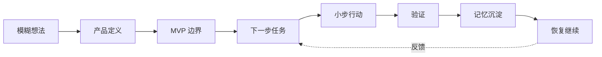
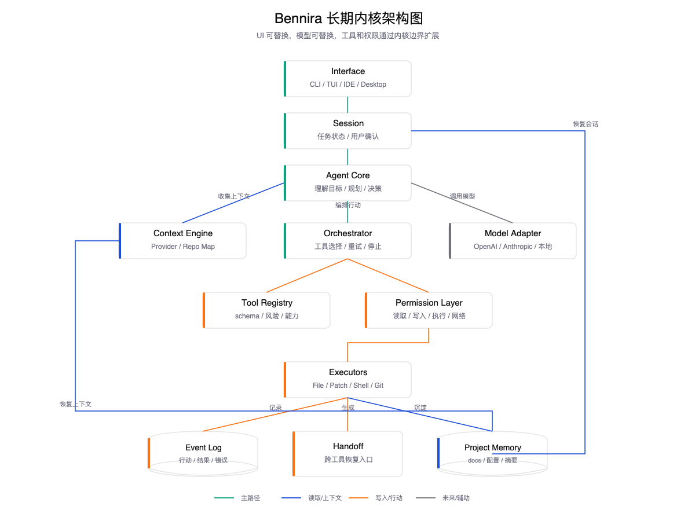
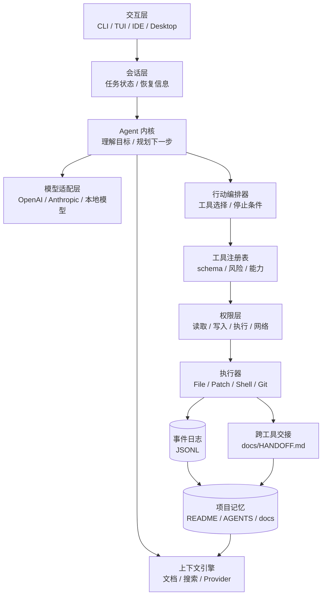
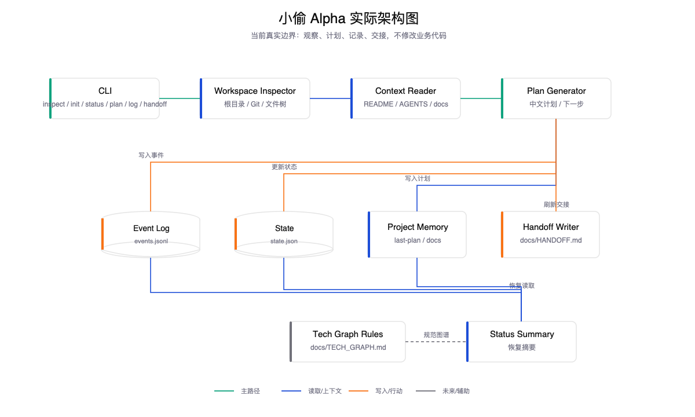
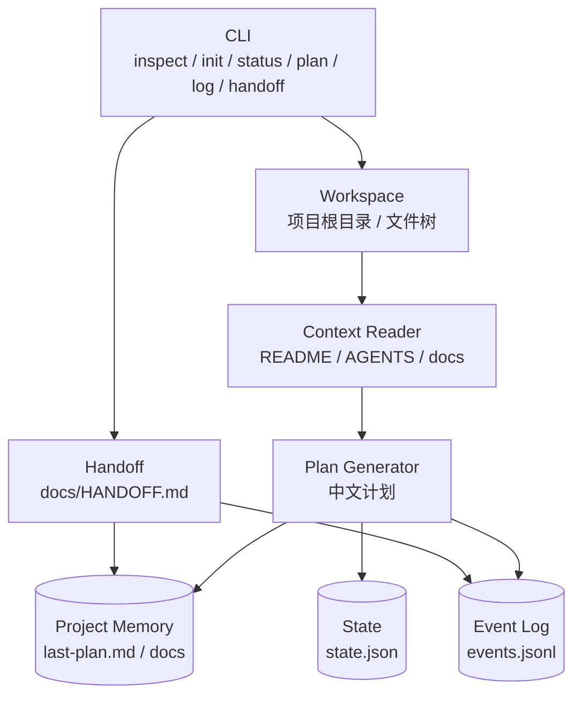

# Bennira 一页说明

## 产品目标

Bennira 的目标是做一个“项目养成型代码 Agent”。

它帮助个人开发者把模糊想法变成可以长期推进的项目状态：

Bennira 的核心不是“比 Codex 更会写代码”，而是：

> 让个人项目的上下文、决策、计划和行动过程可以被持续保存、解释和恢复。

## 为什么用户要用

用户使用 Bennira，不是因为它一开始就比 Codex、Claude Code、Cursor 更强，而是因为它更适合个人项目的早期和长期推进：

- 想法还模糊时，先帮你整理清楚。
- 项目中断后，能从文档和日志恢复上下文。
- 每一步行动可解释、可追踪。
- 中文需求、中文文档、中文版本规范是一等公民。
- 先小步行动，再逐渐放权。

## 当前版本

当前版本线：`Bennira 一代 - 小偷`

“小偷”的含义：

- 轻量进入项目。
- 先观察。
- 找线索。
- 小步行动。
- 不破坏现场。
- 留下记录。

## 当前阶段

当前不是直接做完整产品，而是先做 `小偷 Alpha`。

Alpha 要验证：

> Bennira 能不能把一个模糊中文想法，整理成可恢复、可继续的项目状态。

Alpha 不要求真正修改业务代码。

## Alpha 范围

必须做：

- CLI 原型。
- 工作区识别。
- 文件树扫描。
- 读取 `README.md`、`AGENTS.md`、`docs/`。
- 中文需求澄清。
- 生成或更新项目文档。
- 输出下一步任务。
- 事件日志。
- 会话恢复摘要。

暂不做：

- 真实 Shell 命令执行。
- patch 修改业务代码。
- Git diff。
- 自动测试。
- MCP。
- 插件加载。
- 多 Agent。
- 浏览器。
- 云端任务。
- IDE 插件。

## 整体架构

Bennira 的长期架构分为这些层：

## Alpha 实际架构

Alpha 只实现最小子集：

也就是说，Alpha 先证明：

- Bennira 能看懂当前项目状态。
- Bennira 能把模糊想法整理成文档。
- Bennira 能留下可恢复记录。

## 下一步

最近任务顺序：

1. 确认 `小偷 Alpha` 范围。
2. 决定技术栈。
3. 创建最小 CLI 工程。
4. 实现工作区扫描。
5. 实现项目文档读取。
6. 实现事件日志。
7. 实现项目状态摘要。
8. 实现文档生成或更新。
