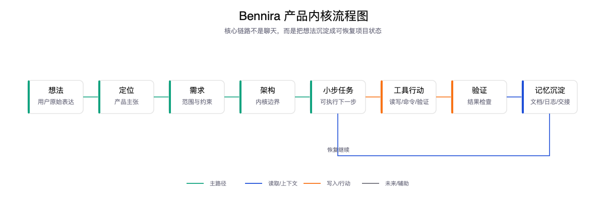
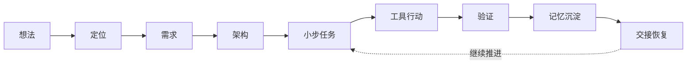
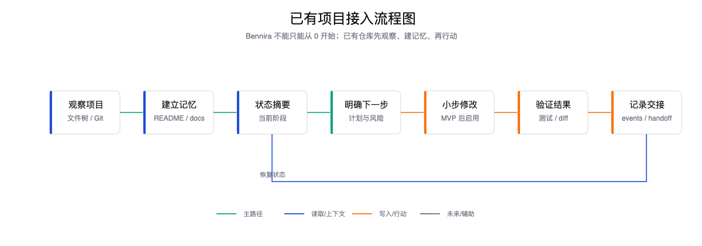
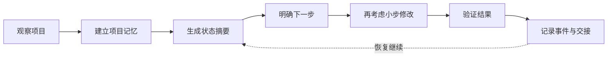

# Bennira 产品定义

## 品类定义

Bennira 是一个“项目养成型代码 Agent”。

它不是单纯的代码生成器，也不是普通聊天机器人，而是帮助个人开发者把一个模糊想法长期养成一个真实项目的本地开发助手。

这个定义目前仍是产品假设，不是已经被市场验证的事实。第一版要验证的是：用户是否真的需要一个先整理项目上下文、再逐步进入代码行动的 Agent。

## 一句话产品主张

Bennira 帮你把模糊想法变成可持续推进的项目：先整理，再观察，再小步行动，最后把每一步都沉淀下来。

更准确地说，Bennira 的核心不是“替你更快写代码”，而是：

> 让个人项目的上下文、决策、计划和行动过程可以被持续保存、解释和恢复。

## 为什么不是另一个 Codex

Codex、Claude Code、Cursor 的强项是：当你已经有一个较明确的开发任务时，它们能高效进入代码库并完成修改。

Bennira 的切入点更靠前：

- 你还不知道自己到底要做什么。
- 你需要把想法讲清楚。
- 你需要把定位、需求、边界、路线图沉淀下来。
- 你希望项目可以长期连续，而不是每次对话重新开始。

Bennira 不是和它们抢同一个起点，而是从“想法变项目”的早期阶段开始陪伴。

## 用户为什么要用 Bennira

### 因为它中文优先

中文不是翻译层，而是需求、产品、文档、版本命名和项目记忆的主语言。

这对很多个人开发者很重要，因为真正复杂的不是写代码，而是把自己的想法说清楚。

但中文优先不能单独成为护城河。它必须和项目记忆、需求澄清、可解释行动结合，才可能形成真正差异。

### 因为它会沉淀项目记忆

Bennira 默认把重要判断写进仓库：

- 为什么做这个项目。
- 当前定位是什么。
- 第一版做什么。
- 第一版不做什么。
- 架构为什么这样设计。
- 下一步是什么。

这些东西不会随着一次对话结束而消失。

### 因为它可解释

Bennira 要让用户知道：

- 它读了哪些文件。
- 它为什么需要这些上下文。
- 它准备做什么。
- 它为什么要调用某个工具。
- 它改了什么。
- 它如何验证。
- 它为什么停下来。

这让用户能建立信任，而不是盲目放权。

### 因为它小步行动

Bennira 不追求一口气自动完成大型项目。

它优先做：

- 小范围修改。
- 明确计划。
- 明确确认。
- 明确 diff。
- 明确验证。
- 明确日志。

这更适合早期个人项目。

### 因为它可恢复

Bennira 的重要状态应该能跨越：

- 换电脑。
- 换会话。
- 换模型。
- 中断任务。
- 长时间搁置。

这要求项目记忆和事件日志从第一版就进入设计。

## 产品内核

Bennira 的产品内核不是“聊天”，而是：

这条链路才是 Bennira 的特色。

其中第一版最需要验证的是前半段：

如果这条链路不成立，后面即使接上代码工具，也很难形成自己的产品价值。

## 使用模式

Bennira 不应该只能从 0 开始。

它必须支持两种使用模式：

### 新项目模式

用户还没有代码，只有一个想法。

Bennira 应该帮助用户：

- 澄清想法。
- 定义产品定位。
- 明确 MVP 边界。
- 生成初始文档。
- 设计第一版架构。
- 输出下一步任务。

### 已有项目模式

用户已经有一个仓库或文件夹。

Bennira 应该能够直接进入现有项目，不要求用户重建项目。

第一阶段应该做到：

- 识别项目根目录。
- 扫描文件树。
- 读取 `README.md`、`AGENTS.md` 和关键 `docs/` 文档。
- 如果缺少项目记忆文件，提出初始化建议。
- 生成项目状态摘要。
- 判断当前项目处于什么阶段。
- 给出下一步任务建议。
- 在用户确认后写入 `.bennira/` 配置和事件日志。

已有项目模式是 Bennira 的关键能力。否则它会变成脚手架工具，而不是项目养成型 Agent。

### 初始化原则

对已有项目，Bennira 不应该一上来改业务代码。

正确顺序是：

这也符合“小偷”版本的产品隐喻：先观察、找线索、留下记录，不破坏现场。

## 早期用户画像

### 独立创造者

有想法，有表达欲，也愿意学习技术，但需要 AI 帮助把混乱想法整理成项目。

### AI 编程工具重度用户

已经用 Codex、Claude Code、Cursor，但希望有一个更懂自己项目历史和中文表达的工具。

### 学习型开发者

希望不仅得到代码，还能理解为什么这么做、怎么拆需求、怎么设计架构。

### 小团队早期项目

不需要企业平台，但需要把需求、规则和执行过程保留下来。

## 非目标用户

Bennira 第一阶段不服务：

- 想完全黑盒自动开发的人。
- 大型企业研发平台。
- 只追求最快代码生成的人。
- 复杂权限、审计、合规团队。
- 已经有成熟工程流程且只需要 IDE 内补全的人。

## 产品护城河设想

### 第一层：项目连续性

仓库里的文档、事件日志、决策记录和路线图，会让 Bennira 越用越懂项目。

### 第二层：可解释内核

用户不是只看最终代码，而是能看到 Agent 的思考轨迹、行动轨迹和验证轨迹。

### 第三层：中文产品流程

把中文需求澄清、产品定位、MVP 定义和架构讨论做深，是很多英文优先工具不会优先做的事。

### 第四层：插件与工作流

未来 Bennira 可以把“需求澄清”“竞品调研”“MVP 定义”“架构评审”“代码修改”“测试修复”等做成可组合工作流。

## 产品原则

- 先整理，再执行。
- 先观察，再修改。
- 先小步，再自动化。
- 先本地，再云端。
- 先内核，再界面。
- 先连续性，再复杂功能。
- 先让用户看懂，再让用户放权。

## 最小品牌心智

Bennira 应该让用户形成这样的印象：

> 它不是替我乱写代码的工具，而是陪我把项目慢慢养起来的助手。
